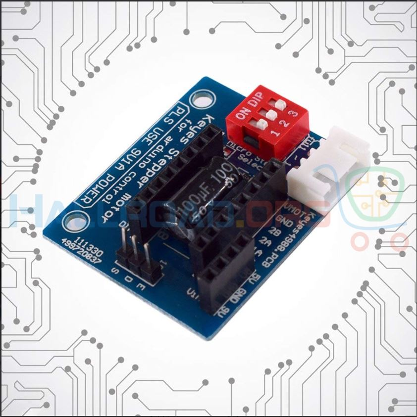

# Conveyer_Cutter
Things you will need:
1. DMM.
2. Wires for connections that we bought.
3. Banana connectors for Power supply. 
4. Power supply.
5. The Buck Converters.
6. Small screw driver and knife (IC has a very small screw).
7. Female to Male connectors jumper wires.
8. Male to Male connectors jumper wires.
9. IC Shield and DRV drivers.
10. Nema42 Driver.

## 1. Nema 17
Place the DRV8825 IC in the module and make sure the pin names are the same on the module and the IC. The location of the current setting
screw should be top left from what I remember.

Connect the 4 pin Connector we bought in the white socket. 
The pin names from the top as shown in the image above to the bottom are : 1B - 1A - 2A - 2B.

Connect one coil to 1B-1A and the other to 2A-2B.
Note: Remember to keep the order same i.e. if you start from the right A of one coil comes then comes A of the second coil and so on. 
Connect 5V from Arduino to the shield and connect GND. 

Now wire the supply using the banana connectors to the Buck Converter. 
Connect High to IN+ and Low to IN-.
Connect OUT+ to 9V on the IC shield and OUT- to the GND on the IC shield. 

Make sure all the connections are correct.
Connect Pin-3 of Arduino to S and Connect Pin-2 of Arduino to D. Leave the E pin. 
Upload the [Motor_Code](/Arduino Code/motors/motors.ino) code to Arduino. 
Change the delay_time variable at the top to 500 and start moving it down to control speed of the motor. Play around with this number only. 

## 2. Nema 42
Red and Black form one pair of coils for the big motor. 
The one without black tape are one pair and vice versa. 
Wire the pair of coils to A and B. 
(Note: Here the pair of coils are identified using names A and B whereas the Nema17 shield used 1 and 2 for naming pairs).

Connect the positive voltage from supply to VCC and GND to GND.
Connect the Pin-3 of Arduino to PUL+ and GND to PUL-
Connect the Pin-2 of Arduino to DIR+ and GND to DIR-

Upload the Arduino code. 
Change the delay_time variable at the top start from 10 and move it up. 
